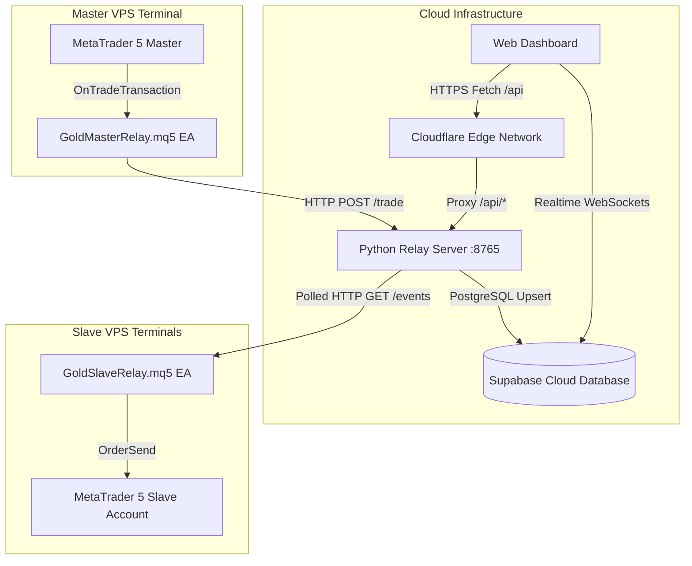

# 🌟 Gold Trade Copier — Comprehensive System Specification & Developer Handbook (GEMINI.md)

-This project is deployed in cloudflare workers, under "https://trade-copier.asjadraza.workers.dev/"

Welcome to the **Gold Trade Copier** repository. This document serves as an exhaustive reference guide detailing system architecture, features, troubleshooting directory, security policies, and safe GitHub deployment workflows.

---

## 🚀 System Architecture Overview



---

## ✨ Complete Feature Matrix

### 1. Master-Slave Trade Replication Engine
- **Ultra-Low Latency**: Master trades replicated to slave terminals in **10–30 ms**.
- **Full SL/TP & Ticket Tracking**: Tracks open positions, lot scaling, stop-loss, take-profit, and order closure.
- **Custom Lot Multiplier**: Scale copy lot size (e.g. 1:1, 0.5x, 2x) individually per slave account.

### 2. Multi-Page Enterprise Web Dashboard
- **📊 Command Center ([`index.html`](file:///C:/Main%20Project/gold-trade-copier/index.html))**: Real-time status cards, connected slaves list, active master trades table, emergency kill button, Supabase WebSocket log stream.
- **⚙️ VPS & System Settings ([`settings.html`](file:///C:/Main%20Project/gold-trade-copier/settings.html))**: Master VPS Relay URL configuration, Live Connection Health Diagnostic Tool, Supabase keys manager, EA installation guide.
- **📈 Trade Execution Analytics ([`analytics.html`](file:///C:/Main%20Project/gold-trade-copier/analytics.html))**: Master trade execution history table, total volume copied, latency stats, replication success rates.

### 3. Interactive Theme System (Dark / Light Mode)
- **Obsidian Dark Aesthetic**: Warm Obsidian (`#0e0d0c`) canvas, Dark Slate (`#181715`) cards, Warm Parchment (`#f3efe6`) typography, and Anthropic Coral (`#cc785c`) accents.
- **Persistent State**: Theme choice automatically saved in `localStorage` and remembered across sessions.

### 4. Admin Passcode Security Shield (Live Site Protection)
- **PIN Authorization**: Default Admin PIN **`7890`** *(configurable in `config.js`)*.
- **Public Read-Only Mode**: Unauthenticated visitors can view overview stats, but remote controls (**Emergency Stop**, **Pause/Resume Slaves**, **Close Ticket**, **Save Settings**) are locked behind PIN authentication.

### 5. Transparent Cloudflare Edge Proxy (`/api/*`)
- Eliminates browser HTTPS Mixed Content restrictions by proxying requests from `https://your-dashboard.pages.dev/api/*` to `http://YOUR_VPS_IP:8765` at the Cloudflare Edge level.

---

## 🛠️ Complete Troubleshooting & Error Directory

| Error / Symptom | Root Cause | Exact Resolution |
| :--- | :--- | :--- |
| **`TypeError: Failed to fetch`** when testing VPS connection | Browser HTTPS Mixed Content security policy blocks direct fetches from `https://` to `http://` IP addresses. | Ensure the dashboard connects using the Edge Proxy route `/api/dashboard-summary` instead of raw `http://...`. |
| **`Failed: error occurred while updating repository submodules`** on Cloudflare Pages | Subfolder was tracked in Git as mode `160000` (submodule) without a valid `.gitmodules` entry. | Run `git rm --cached gold-trade-copier`, re-add files directly with `git add gold-trade-copier`, commit, and push. |
| **`Relay returned HTTP 401 Unauthorized`** | Mismatch between the `X-API-Key` sent in request headers and the `API_KEY` configured in `relay_server.py`. | Verify `X-API-Key` in the dashboard **Credentials** modal matches `API_KEY` in `relay_server.py`. |
| **`Master VPS Status: OFFLINE` / `HTTP 502 Bad Gateway`** | `relay_server.py` is not running, or Port 8765 is blocked by VPS Firewall / AWS Security Group. | 1. Start `python relay_server.py` on VPS.<br>2. Open inbound TCP port 8765 (`sudo ufw allow 8765/tcp` or AWS Inbound Rule). |
| **`SyntaxError: Unexpected token ':'` in Cloudflare Pages Build** | Syntax error in `functions/api/[[path]].js` header setter. | Replaced colon `:` with comma `,` inside `finalHeaders.set("Access-Control-Allow-Headers", ...)`. |

---

## 🛡️ Safe GitHub Deployment Workflow

To prevent breaking live Cloudflare Pages builds when pushing updates to GitHub:

### 1. Pre-Push Safety Checklist:
```powershell
# A. Check for any illegal Git Submodule references (mode 160000)
git ls-files -s | Select-String "160000"

# B. Verify JavaScript syntax in Cloudflare Functions
node -c "dashboard/functions/api/[[path]].js"
node -c "functions/api/[[path]].js"

# C. Ensure root files and dashboard files are synchronized
Copy-Item -Path 'dashboard\index.html' -Destination 'index.html' -Force
Copy-Item -Path 'dashboard\settings.html' -Destination 'settings.html' -Force
Copy-Item -Path 'dashboard\analytics.html' -Destination 'analytics.html' -Force
Copy-Item -Path 'dashboard\config.js' -Destination 'config.js' -Force
```

### 2. Execute Clean Git Push:
```powershell
git add .
git commit -m "Describe your changes clearly"
git push origin main
```

---

## 📄 Key File Sitemap

- [`index.html`](file:///C:/Main%20Project/gold-trade-copier/index.html) — Command Center (Root)
- [`settings.html`](file:///C:/Main%20Project/gold-trade-copier/settings.html) — VPS & System Settings (Root)
- [`analytics.html`](file:///C:/Main%20Project/gold-trade-copier/analytics.html) — Trade Analytics (Root)
- [`config.js`](file:///C:/Main%20Project/gold-trade-copier/config.js) — Central Configuration & Security (Root)
- [`functions/api/[[path]].js`](file:///C:/Main%20Project/gold-trade-copier/functions/api/%5B%5Bpath%5D%5D.js) — Cloudflare Edge API Proxy
- [`gold-trade-copier/relay_server.py`](file:///C:/Main%20Project/gold-trade-copier/gold-trade-copier/relay_server.py) — Python Master VPS Relay Server
- [`gold-trade-copier/GoldMasterRelay.mq5`](file:///C:/Main%20Project/gold-trade-copier/gold-trade-copier/GoldMasterRelay.mq5) — Master MT5 Expert Advisor
- [`gold-trade-copier/GoldSlaveRelay.mq5`](file:///C:/Main%20Project/gold-trade-copier/gold-trade-copier/GoldSlaveRelay.mq5) — Slave MT5 Expert Advisor
- [`gold-trade-copier/SETUP_GUIDE.md`](file:///C:/Main%20Project/gold-trade-copier/gold-trade-copier/SETUP_GUIDE.md) — 20-Minute Complete Setup Guide
