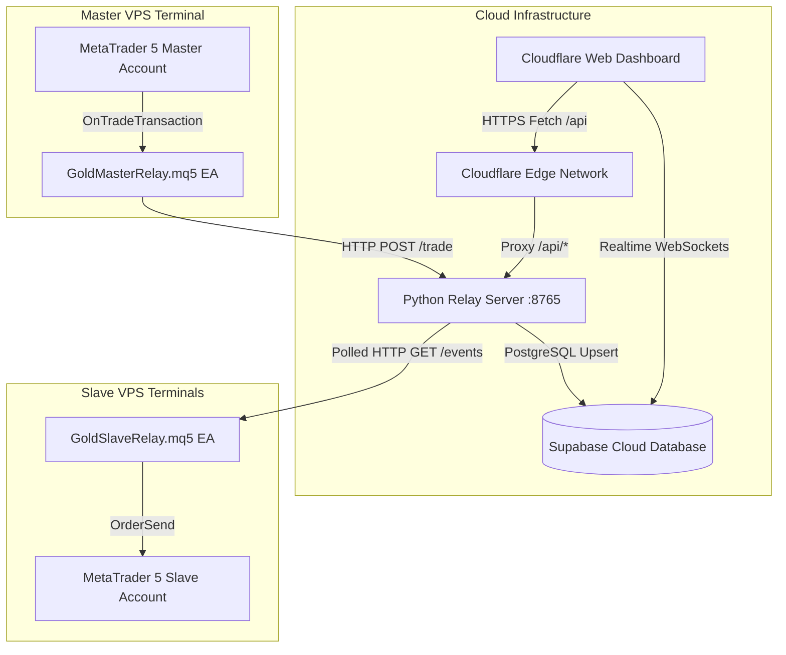

# 🌟 Gold Trade Copier — Ultra-Low Latency MT5 Trade Replication System

[](https://www.metatrader5.com/)
[](https://www.python.org/)
[](https://pages.cloudflare.com/)
[](https://supabase.com/)
[](LICENSE)

**Gold Trade Copier** is an enterprise-grade, high-frequency Master-to-Multi-Slave MetaTrader 5 trade copying system with real-time web monitoring, custom lot scaling, cloud database persistence, and remote emergency VPS controls.

---

## 🚀 System Architecture



---

## ✨ Features Overview

### 1. Master-to-Slave Copy Engine (10–30 ms Latency)
- **Instant Event Capture**: The Master EA (`GoldMasterRelay.mq5`) uses MQL5 `OnTradeTransaction` memory hooks to push trade entries, SL/TP modifications, and order closures instantly.
- **Custom Lot Scaling**: Individual lot multipliers per Slave EA (e.g. `1.0` for 1:1 copying, `0.5` for half size, `2.0` for double size).
- **Symbol Translation**: Map different broker symbols seamlessly (e.g. `XAUUSD` to `GOLD` or `XAUUSD.a`).

### 2. Multi-Page Enterprise Web Dashboard
- **📊 Command Center ([`index.html`](file:///C:/Main%20Project/gold-trade-copier/index.html))**: Live overview of Master VPS status, online Slave terminals, active open master positions, Emergency Stop button, and Supabase Realtime log stream.
- **⚙️ VPS & System Settings ([`settings.html`](file:///C:/Main%20Project/gold-trade-copier/settings.html))**: Master VPS Relay URL configuration, Live Connection Health Diagnostic Tool, Supabase credentials manager, and MT5 EA installation guide.
- **📈 Trade Execution Analytics ([`analytics.html`](file:///C:/Main%20Project/gold-trade-copier/analytics.html))**: Historical trade replication log table, total volume copied, replication latency stats, and success rates.

### 3. Interactive Theme System (Dark / Light Mode)
- **Obsidian Dark Aesthetic**: Modern Warm Obsidian (`#0e0d0c`) canvas, Dark Slate (`#181715`) cards, Warm Parchment (`#f3efe6`) typography, and Anthropic Coral (`#cc785c`) accents.
- **Auto-Persistent Theme**: Switches between Light and Dark mode with 1-click and remembers state via `localStorage`.

### 4. Admin Passcode Security Shield (Live Site Protection)
- **PIN Authorization**: Default Admin PIN **`7890`** *(configurable in `config.js`)*.
- **Public Read-Only Mode**: Unauthenticated visitors can view overview stats, but remote controls (**Emergency Stop**, **Pause/Resume Slaves**, **Close Ticket**, **Save Settings**) are locked behind PIN authentication.

### 5. Transparent Cloudflare Edge Proxy (`/api/*`)
- Eliminates browser HTTPS Mixed Content restrictions by proxying requests from `https://your-dashboard.pages.dev/api/*` to `http://YOUR_VPS_IP:8765` at the Cloudflare Edge level.

---

## 📁 Repository Sitemap

```text
gold-trade-copier/
├── index.html                   # Command Center Dashboard (Page 1)
├── settings.html                # VPS Credentials & Health Tester (Page 2)
├── analytics.html               # Trade Analytics & History (Page 3)
├── config.js                    # Central System Settings & Security
├── GEMINI.md                    # Comprehensive System Specification & Developer Handbook
├── CLAUDE.md                    # Architecture Map & Coding Standards
├── functions/
│   └── api/
│       └── [[path]].js          # Cloudflare Pages Function (HTTPS API Proxy)
├── gold-trade-copier/
│   ├── relay_server.py          # Python Master VPS Relay Server (Flask + SQLite)
│   ├── GoldMasterRelay.mq5      # Master MT5 EA (Captures & Pushes Trades)
│   ├── GoldSlaveRelay.mq5       # Slave MT5 EA (Polls & Executes Trades)
│   ├── SETUP_GUIDE.md           # 20-Minute Step-by-Step Setup Guide
│   ├── supabase_schema.sql      # Supabase Cloud Database SQL Schema
│   └── requirements.txt         # Python Dependencies (Flask, requests, supabase)
└── Telegram Notifier/
    ├── TelegramNotifier.mq5     # Optional Telegram Trade Alerts EA
    └── SETUP_GUIDE.md
```

---

## 🛠️ Quick 5-Step Deployment Guide

### Step 1: Start Master Relay Server on Master VPS
On your Master VPS terminal:
```bash
cd gold-trade-copier
pip install -r requirements.txt
python relay_server.py
```
Open inbound TCP port `8765` in your VPS firewall / AWS Security Group rules (`sudo ufw allow 8765/tcp`).

### Step 2: Attach Master EA on Master MT5
1. Open MT5 on Master VPS $\rightarrow$ **File > Open Data Folder > MQL5 > Experts**.
2. Copy `GoldMasterRelay.mq5` into Experts and compile.
3. Allow WebRequest to `http://localhost:8765` in MT5 Options $\rightarrow$ Expert Advisors.
4. Attach `GoldMasterRelay` to any chart (e.g. `XAUUSD`).

### Step 3: Attach Slave EA on Slave MT5
1. Copy `GoldSlaveRelay.mq5` into Slave MT5 Experts folder.
2. Allow WebRequest to `http://YOUR_MASTER_VPS_IP:8765`.
3. Set inputs: `RelayURL` = `http://YOUR_MASTER_VPS_IP:8765`, `SlaveID` = `Slave_VPS_1`, `LotMultiplier` = `1.0`.

### Step 4: Setup Supabase Database (Optional)
Run [`gold-trade-copier/supabase_schema.sql`](file:///C:/Main%20Project/gold-trade-copier/gold-trade-copier/supabase_schema.sql) in your Supabase SQL Editor to enable Cloud Persistence & WebSockets.

### Step 5: Deploy Web Dashboard to Cloudflare Pages
1. Push this repository to **GitHub**.
2. Go to **Cloudflare Dashboard > Workers & Pages > Create application > Pages > Connect to Git**.
3. Select your repository and set Build Settings:
   - **Framework preset**: `None`
   - **Root directory**: `/` *(or `dashboard`)*
   - **Build output directory**: `.`
4. Click **Save and Deploy**.

---

## ❓ Troubleshooting Directory

| Symptom / Error | Cause | Resolution |
| :--- | :--- | :--- |
| **`TypeError: Failed to fetch`** | Direct fetch from HTTPS site to raw HTTP IP blocked by browser Mixed Content policy. | Route requests through Edge Proxy `/api/dashboard-summary` instead of raw `http://...`. |
| **`Failed: error occurred while updating submodules`** | Subfolder tracked as mode `160000` without `.gitmodules` entry. | Run `git rm --cached gold-trade-copier`, re-add files, commit, and push. |
| **`Relay returned HTTP 401 Unauthorized`** | Header `X-API-Key` mismatch. | Ensure `X-API-Key` in dashboard matches `API_KEY` in `relay_server.py`. |
| **`Master VPS Status: OFFLINE`** | `relay_server.py` not running or port 8765 blocked. | Start `python relay_server.py` and open port 8765 in firewall. |

---

## 📄 License

This project is licensed under the [MIT License](LICENSE).
